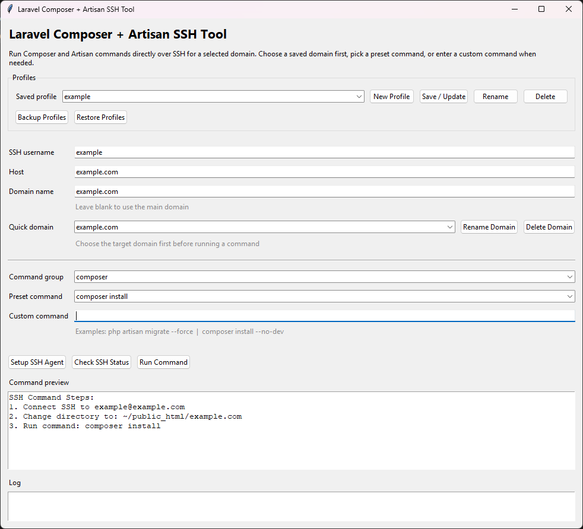

# 🚀 Composer + Artisan SSH Tool

A lightweight desktop GUI tool for running **Composer** and **Laravel Artisan** commands directly over SSH.

Built with **Python + Tkinter**, designed for fast remote execution without manually logging into a terminal.

---

## 📸 Screenshot



---

## ✨ Features

- ⚡ Run Composer commands remotely
- 🔧 Run Laravel Artisan commands via SSH
- 🌐 Domain-based targeting (main domain or subdomain)
- 💾 Multiple profiles (save SSH + domain config)
- 🔽 Quick domain dropdown (recent domains)
- 🧠 Smart command handling:
  - Success (exit code 0)
  - Completed with warnings
  - Real failure detection
- 🧾 Command preview before execution
- 🪵 Live logs output
- 🔐 SSH Agent setup helper (Windows / PowerShell)

---

## 🧰 Supported Commands

### Composer

- composer install
- composer install --no-dev
- composer install --no-dev -o
- composer update
- composer diagnose
- composer dump-autoload
- composer dump-autoload -o
- composer clear-cache

### Artisan

- php artisan optimize
- php artisan optimize:clear
- php artisan migrate
- php artisan migrate --force
- php artisan db:seed
- php artisan db:seed --force
- php artisan migrate --seed
- php artisan migrate --seed --force
- php artisan key:generate
- php artisan key:generate --force
- php artisan config:clear
- php artisan config:cache
- php artisan cache:clear
- php artisan route:clear
- php artisan route:cache
- php artisan view:clear
- php artisan view:cache
- php artisan queue:restart
- php artisan storage:link

### Custom

- Run any custom SSH command manually

---

## ⚙️ How It Works

1. Select or create a profile
2. Choose domain (or leave blank for main domain)
3. Pick command group (composer / artisan / custom)
4. Run command via SSH
5. View logs and status

---

## 🔑 SSH Key Setup

This tool uses a **private SSH key downloaded from cPanel / shared hosting**.

### 📥 Step 1: Generate & Download Key (cPanel)

1. Go to **cPanel → SSH Access → Manage SSH Keys**
2. Generate a new key (if not yet created)
3. Click **Download Key** (Private Key)

---

### 📍 Step 2: Place Key Locally

Save the downloaded private key to your `.ssh` directory:

`C:\Users\<your-username>\.ssh\id_rsa`

---

### ✅ Requirements

- File must be renamed to: id_rsa
- Must be inside: `C:\Users\<your-username>\.ssh`
- Do NOT rename with extension (no `.txt`, `.pem`, etc.)

Example:

`C:\Users\Romel\.ssh\id_rsa`

---

### 🔐 Step 3: Authorize Key (Important)

Make sure the public key is **authorized in cPanel**:

- cPanel → SSH Access → Manage SSH Keys
- Click **Manage → Authorize**

---

### ⚡ Optional: Add to SSH Agent (Windows)

```
ssh-add C:\Users\<your-username>\.ssh\id_rsa
```

---

## 📁 Config Storage

Saved in:

`%APPDATA%/ComposerArtisanTool/composer_artisan_profiles.json`

---

## 🖥️ Build (EXE)

```
pyinstaller --onefile --windowed composer_artisan_ssh_tool.py
```

---

## ⚠️ Notes

- Requires SSH access (cPanel / VPS / shared hosting)
- Uses your local private key (from cPanel)
- Composer/Artisan must be available on server

---

## 📄 License

MIT License — see the [LICENSE](LICENSE) file for details.